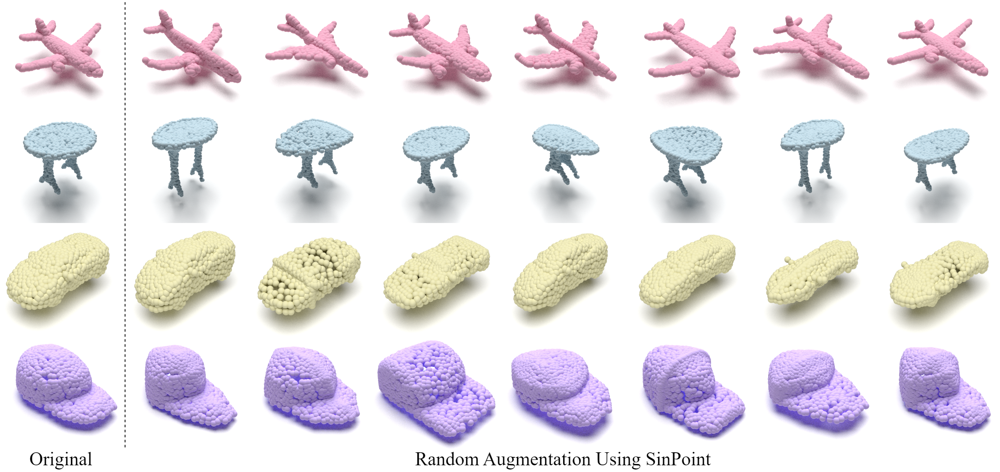

# SinPoint

<div align="center">
  
</div>

Augmented point clouds using SinPoint. In each row, the left-most sample is the original, and the remaining samples are its transformed results. Our SinPoint can generate high-fidelity and diverse data samples.


## Install

```bash
# Optional solution for step 2: install libs step by step
conda create -n SinPoint python=3.7 -y
conda activate SinPoint
conda install pytorch==1.10.1 torchvision==0.11.2 cudatoolkit=10.2 -c pytorch -y
pip install cycler einops h5py pyyaml==5.4.1 scikit-learn==0.24.2 scipy tqdm matplotlib==3.4.2
```


## Useage

### Classification ModelNet40
**Train**: The dataset in here.

By default, it will create a folder named "checkpoints/{modelName}-{msg}-{randomseed}", which includes args.txt, best_checkpoint.pth, last_checkpoint.pth, log.txt, out.txt.
```bash
cd classification_ModelNet40
# train SinPoint
bash train.sh
# please add other paramemters as you wish.
```

To conduct without voting testing, run
```bash
# please modify the msg accrodingly
bash test.sh
```

### Classification ScanObjectNN

The dataset will be automatically downloaded

- Train SinPoint 
```bash
cd classification_ScanObjectNN
# train SinPoint
bash train.sh
# please add other paramemters as you wish.
```
By default, it will create a fold named "checkpoints/{modelName}-{msg}-{randomseed}", which includes args.txt, best_checkpoint.pth, last_checkpoint.pth, log.txt, out.txt.

## Acknowledgment

Our implementation is mainly based on the following codebases. We gratefully thank the authors for their wonderful works.

[CurveNet](https://github.com/tiangexiang/CurveNet),
[PointMLP](https://github.com/ma-xu/pointMLP-pytorch),
[GDANet](https://github.com/mutianxu/GDANet),
[Pointnet2_PyTorch](https://github.com/erikwijmans/Pointnet2_PyTorch)
